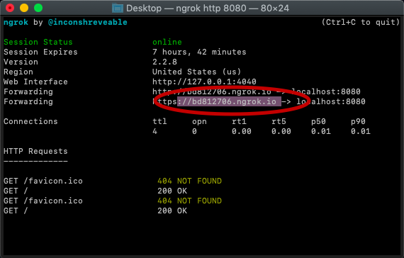
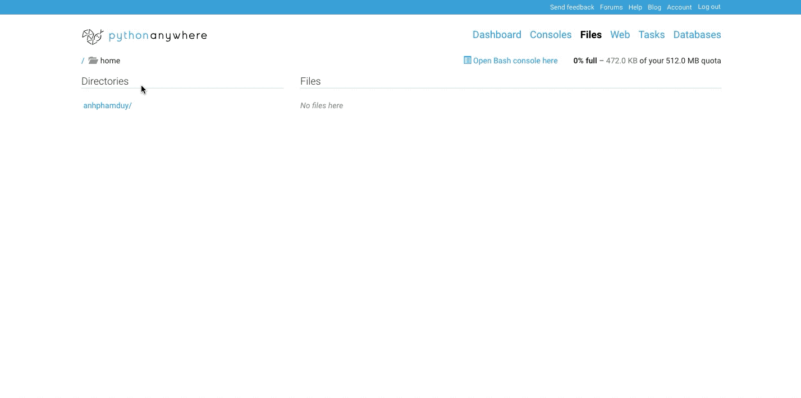
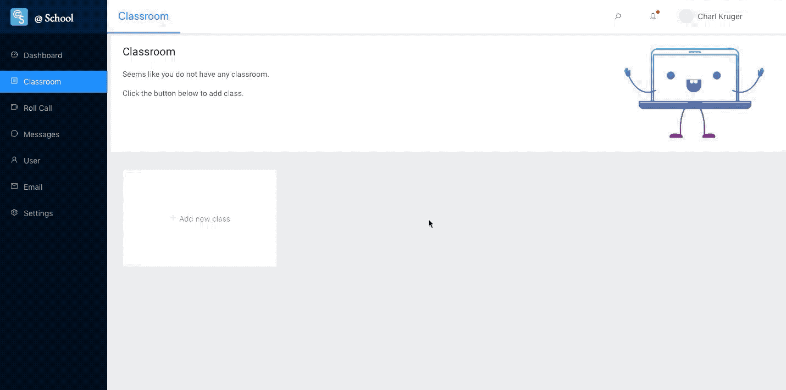
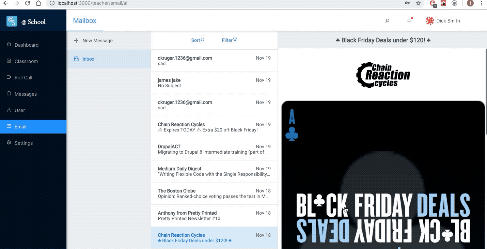
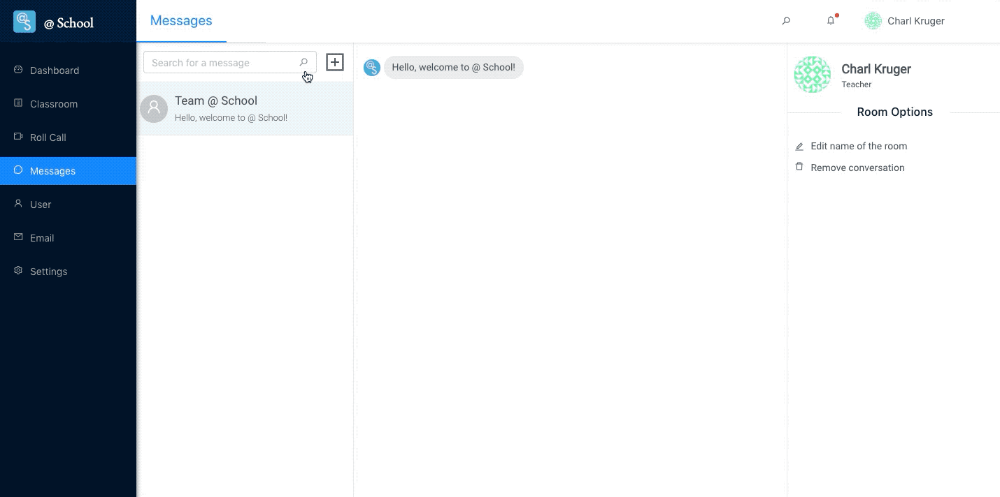

#  @ School Documentation #

The final project did meet all the planned criteria of the timeline, with minor variation in the completion time for each criterion. Although, whilst certain aspects were finished in accordance with the planning they did not quite meet the specific requirements posted in the original project planning. Within the web application it does meet the criteria in regard to centralising information, through the working messaging and email system although did not contain a clear dashboard inside the classroom route. Whilst this was not explicitly stated in the timeline it was a goal in the original project planning, and was not met by the final date.

One of the goals of Atschool was to reduce waiting time, this was the reason for technologies such as React and WebSockets, it can be said with certainty that this criteria was met, and that the majority of time spent on the project was to make this goal a reality.

One of the major challenges in loading time was the email route, as it took a surplus of 30 seconds to query emails from the Google SMTP servers. This was resolved through creating a local database to store emails in JSON format to make querying instantaneous as well as multi threading the server and use of websockets. This meant the slow new queries from the Google server could happen as a background process allowing for maximum efficiency for the user.

Another problem we had was the compatibility between our various technologies, for instance the wtf-kit not supporting the newest version of css, as such we had to have inconsistencies in our app, some parts using the latest version of css while others use an older version. We also had to make a recursive function in order to convert our Javascript styling in Aphrodite to text that could be compiled to css in use of the PDF module in python.

Originally we had used SQL, although later changed to to monogDB to improve efficiency, this was not originally predicted in the project planning although

Arguably the major reason that some criteria were not fully met was due to the change in hosting service, originally the application was hosted on GitHub pages, although there was a problem with React Router and the service, that didn’t allow you to directly access a URL from the URL bar. This meant we needed to change the service provider Amazon AWS which was quite time consuming given our lack of knowledge.

## Enabling push notifications

1. Install [ngrok](https://ngrok.com/download)

2. cd to the location of ngrok and unzip the folder
3. run `./ngrok http 8080`
4. Save the last *following* link

	</img>

5. Log in to [PythonAnywhere](https://www.pythonanywhere.com/login/) and sign in with the following credentials, **Username:** anhphamduy, **Password:** cuncun123

6. Go to the files route in the top right hand corner of the dashboard
7. Go to *mysite/* route in under the directories heading
8. Go to *flask_app.py* under the files heading
9. In line 20 replace the first argument of the post method with the link you saved from step 4 and save the file and click the reload button nex to the >>> Run button

	</img>

:smile: Yes! You have now enabled push notifications.

##  How to run

In order to test all the major features, one needs to make a teacher account. To do this you will need to have both the [spa](#spa) and the [Server](#server) running. Once working, visit http://localhost:3000/ to access the website. Once on, go to `Sign in` in the top right corner of the page. Once redirected click on the Register `here` link to make an account. Be sure to create a **teacher** account. Now sign in using the credentials you just created. Nice, you should now be able to access the
SPA, visit [here](#test) to learn how to test all the features.

###  Running the SPA ###

1. `cd /spa`
2. follow instruction under `how to run` of the README.md in that directory

###  Running the Server ###

1. `cd /server`
2. follow instruction under `how to run` of the README.md in that directory

##  Testing Major Features ##

> Make sure you are on the application before starting. If you are unsure follow the instructions posted under [How to run](#howtorun)

###  Creating a classroom

1. Navigate to the *classroom* link on the sidebar

2. Click on *Add new class*
3. Follow the steps provided. Make sure top upload in image, otherwise it will not allow you to create a classroom.
4. Click on the newly created classroom.

5. Now that a new classroom has been made you need to add students. To do this click the `Add new student` button to the right of the screen. In the modal typ eof the name of any previously created student account.

	</img>

### Autonomous Authentications
> To test the authentication you will need to have made a [classroom](#classroom) with students enrolled and have both a student and teacher account. Also be sure to have set up the mobile app. Instructions for the this is avaliable [here](https://github.com/at-school/mobile/blob/master/README.md)

1. Once the mobile app is set up login with student credentials and go the camera screen and take a photo of the students face with the red bar across the top of the screen.

2. Log in to the web application via a teacher account then go to the role call route on the side bar. Click the real time marking button. The web cam LED should light up and the server should detect the face of any student that you enrolled in the classroom and that have uploaded their faces via the Mobile app. You can test whether it is working by seeing if the student count under the students card increases as you put the face of one of the student account up to the web cam.

### Emails

> To test emails make sure that you have push notifications working. If you are unsure how to do this follow the instructions posted under [Enabling push notifications](#push-notifications)

1. Log in and go the the email route on the sidebar

2. Follow the instructions and login to any Google account, wait a little bit and it should start loading all the emails.
3. To test sending emails, click on new message above the inbox bar. Fill out the receiver input with the email you logged in with in step 2 and click the send button. Wait a few seconds and you should receive the email in the inbox. To validate that an email was actually sent you can log into Gmail with the account and check.

	</img>

### Messaging

> To test the messaging be sure to have either two student/teacher accounts.

1. With the first account login and go to the **_Messages_** route on the sidebar.

2. Then click the plus icon next to the search bar.
3. In the newly created input field type the name of your second account and click the arrow on the right.
4. Now you are able to message the user.
5. To check that the user indeed received the message login with the second user and check the messages. You can also try side by side to see the other user receive the message in real time.

	</img>
